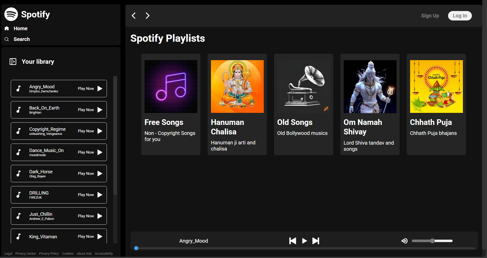
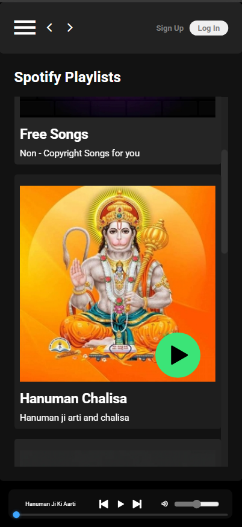

<h1>🎧 Spotify Clone</h1>

<h2>A front-end-only Spotify-inspired music player built with HTML, CSS, and JavaScript. This clone supports album-based music browsing, playback controls, and a smooth UI experience.</h2>

<h2>Desktop</h2>

<h2>Mobile</h2>

🔗 Live Demo
<a href="https://spotify-clone-henna-one-55.vercel.app/" target="_blank">🚀 Try the App Live on Vercel</a>

<h2>🎧 Features</h2>
<ul>
  <li>🎶 Load songs dynamically via JavaScript</li>
  <li>📁 Music grouped by albums/categories</li>
  <li>⏯️ Full playback controls (play, pause, next, previous)</li>
  <li>📊 Interactive progress bar and volume slider</li>
  <li>📱 Fully responsive for mobile and desktop</li>
  <li>📦 Zero dependencies – pure HTML/CSS/JS</li>
</ul>

<h2>🔧 Technologies Used</h2>

<table>
  <thead>
    <tr>
      <th>Tech</th>
      <th>Role</th>
    </tr>
  </thead>
  <tbody>
    <tr>
      <td>HTML5</td>
      <td>Markup</td>
    </tr>
    <tr>
      <td>CSS3</td>
      <td>Styling and layout</td>
    </tr>
    <tr>
      <td>JavaScript</td>
      <td>Functionality/logic</td>
    </tr>
    <tr>
      <td>Vercel</td>
      <td>Deployment</td>
    </tr>
  </tbody>
</table>

<h2>📁 Project Structure</h2>

<pre>
Spotify-Clone/
├── <b>css</b>                # App styling
├── <b>data/</b>              # JSON file with album/song info
├── <b>images/</b>            # Album covers and icons
├── <b>script/</b>            # JavaScript logic files
├── <b>songs/</b>             # Music files organized by folder
├── <b>index.html</b>         # Main entry point
└── <b>Screen-Shots</b>       # Screen Shots
└── <b>README.md</b>          # Project documentation
</pre>

<h2>⚙️ How to Run Locally</h2>
<ol>
  <li>Clone the repository:
    <pre><code>git clone https://github.com/RonakSingh2006/Spotify-Clone.git
    cd Spotify-Clone</code>
    </pre>
  </li>
  <li>Run it using a live server </li>
  <li>Open <code>http://localhost:3000</code> in your browser.</li>
</ol>

<h2>🙋‍♂️ Author</h2>

<b>Ronak Singh</b> 
<a href="mailto:ronaksingh201106@gmail.com">ronaksingh@gmail.com</a> 
<a href="https://github.com/RonakSingh2006" target="_blank">GitHub Profile</a>
